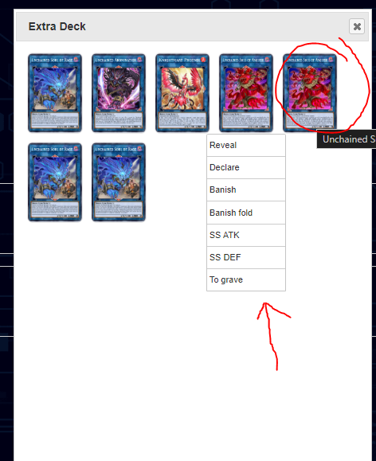
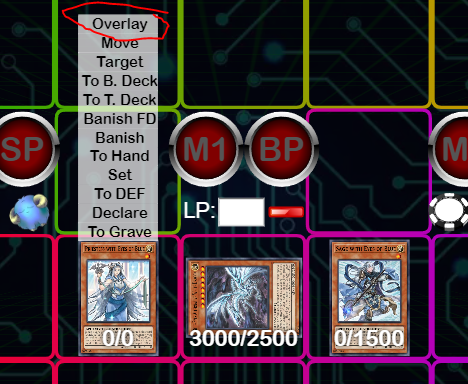
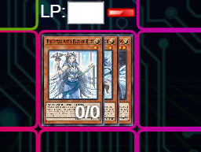
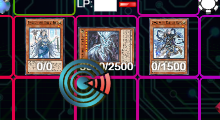
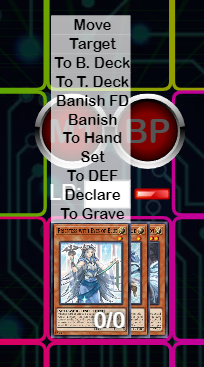
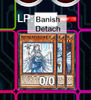
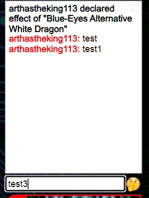

# Issue 7

## 1. New `Phase` Feature

- Add 6 phases to field.
- 
- Phase:
    1. DP (Draw Phase)
    2. SP (Stand By)
    3. M1 (Main Phase 1)
    4. BP (Battle Phase)
    5. M2 (Main Phase 2)
    6. EP (End Phase)

- UI:
    1. Design can be flexible.
    2. Doesn't need to be the same as screenshot example above.

- On Page load:
    - `Main Phase` will be selected by default.

- When Phase selected:
    1. Phase Icon will be highlighted.
        - 
    2. Add a Log:
        - `Enter {phaseName (full name)}`
        - Ex: `Enter Draw Phase`
    3. Add to replay log:
        - Allow phase selection will be a part of replay.
        - Capture log in replay.
        - Show log + highlight phase icon when running replay.
    4. Optional (if easy):
        - Show a popup text (phase full name) in middle of the screen in 1 or 0.5 second. (similar to `declare` effect)
        - Ex: 

## 2. New `Declare` animation

- Background:
    - User complain that `Declare` animation is not clear since this is being used a lot in combo. 
    - `Declare` definition:
        - Declare an effect activation of a card. When declaring an effect, that card will do something to other cards.

    - Currently, `Declare` is using `Reveal` animation temporary, user like this since it's empathize the card is activating its effect.

- New Animation:
    - New animation for `Declare`.
    - Should be similar to `Reveal` but a little bit different in order to distinguish between `Declare` and `Reveal`.
    - Design can be flexible.
    - May be a shining effect on top of `Reveal` + sound effect `(.sound/declare-sound-effect.mp3)` is good enough.

## 3. New `Skill` feature

- Check property `skill` in json:
    - If `skill` is not null:
        - Add a button `Activate {skillName}` for user can click on it to activate it
        - When user click on `Activate {skillName}`:
            - Add to log: `Activate {skillName}`
            - Add a text to middle of screen `{skillName}` (similar to `Phase` feature above)
            - Add to replay when in capture replay mode.
        
    - If `skill` is null or undefined:
        - Don't show activate skill button.

- When playing existing replay:
    - Hide activate skill button.

## 4. Multiple duplicated card menu not showing correctly when hover over it.

- If duplicated card in the deck, menu/action will not show correctly
- 

- Card can be duplicated. Therefore, menu need to be shown on correct card.

## 5. New `Overlay` feature

- New menu option `Overlay`
    - 
- `Overlay` definition: Grouping multiple card into 1 group of cards. This group of card have 1 card represent all cards under it.
    - Ex: 

- When select `Overlay` option:
    - User can select another card to put that card under it.
    - Ex: 

- When cards are in `Overlay`:
    - All cards are treated as 1 card.
    - Show menu as a regular card.
    - Ex: 

    - User can hover over cards under the top card to select 2 options:
        - `Detach` = `To Grave`
        - `Banish FU`
        - Ex: 

        - When select `Detach`:
            - Send card `To Grave`.
        - When select `Banish FU`:
            - Send card to Banish face up.

- When Overlay card send `To Grave`/`To Deck`/`Banish`/`To Ex Deck`/`To Hand` (all other zones):
    - Send the top card to that zone.
    - Send all cards under it `To Grave`

## 6. User Chat Input

- User want to manually add custom log
- Add a chat input under logs
- Ex: 
- When user enter chat:
    - Add to Log
    - When Recording combo:
        - Save user chat to log

- When playing combo contain user chat:
    - Show user chat in log in the same order.