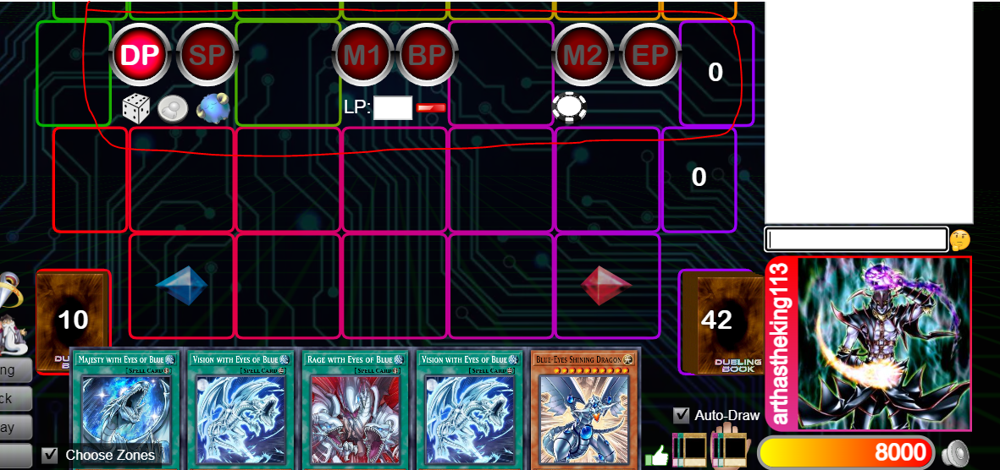
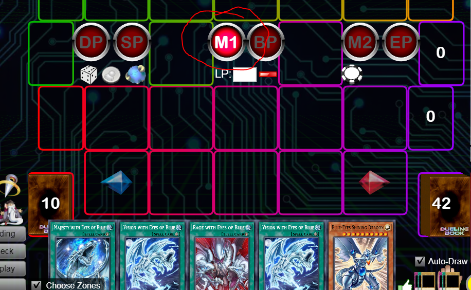
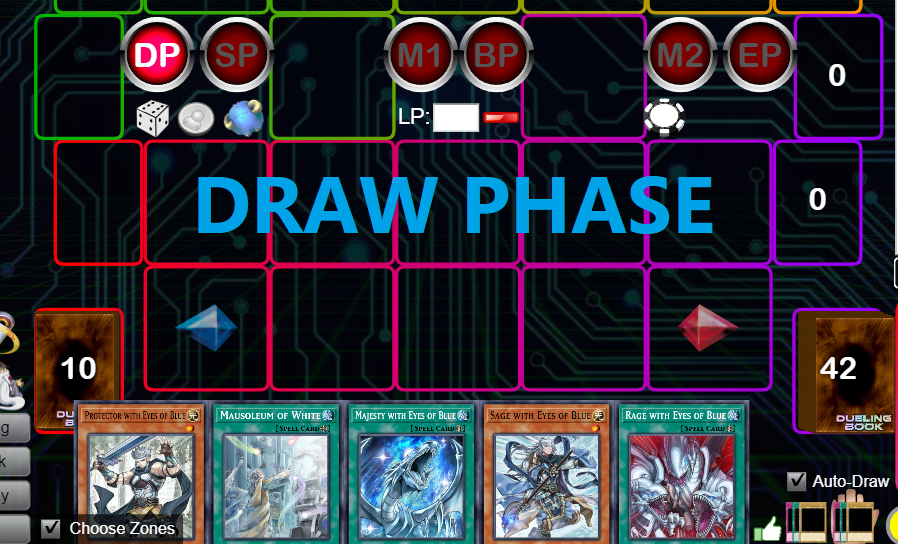

# Issue 7

## 1. Phase

- Add 6 phases to field.
- 
- Phase:
    1. DP (Draw Phase)
    2. SP (Stand By)
    3. M1 (Main Phase 1)
    4. BP (Battle Phase)
    5. M2 (Main Phase 2)
    6. EP (End Phase)

- UI:
    1. Design can be flexible.
    2. Doesn't need to be the same as screenshot example above.

- On Page load:
    - `Main Phase` will be selected by default.

- When Phase selected:
    1. Phase Icon will be highlighted.
        - 
    2. Add a Log:
        - `Enter {phaseName (full name)}`
        - Ex: `Enter Draw Phase`
    3. Add to replay log:
        - Allow phase selection will be a part of replay.
        - Capture log in replay.
        - Show log + highlight phase icon when running replay.
    4. Optional (if easy):
        - Show a popup text (phase full name) in middle of the screen in 1 or 0.5 second. (similar to `declare` effect)
        - Ex: 

## 2. New `Declare` animation

- Background:
    - User complain that `Declare` animation is not clear since this is being used a lot in combo. 
    - `Declare` definition:
        - Declare an effect activation of a card. When declaring an effect, that card will do something to other cards.

    - Currently, `Declare` is using `Reveal` animation temporary, user like this since it's empathize the card is activating its effect.

- New Animation:
    - New animation for `Declare`.
    - Should be similar to `Reveal` but a little bit different in order to distinguish between `Declare` and `Reveal`.
    - Design can be flexible.
    - May be a shining effect on top of `Reveal` + sound effect `(.sound/declare-sound-effect.mp3)` is good enough.