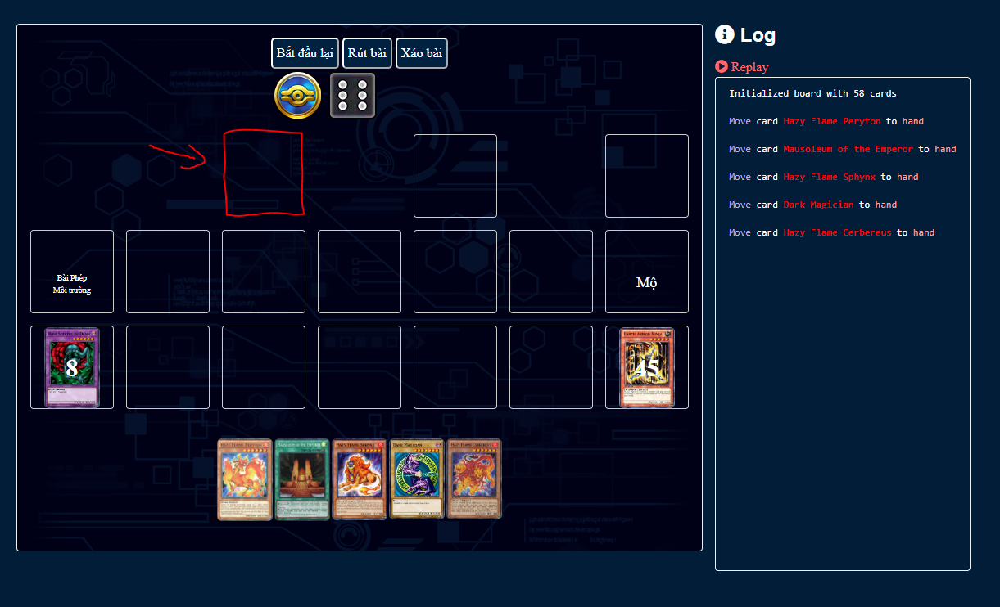
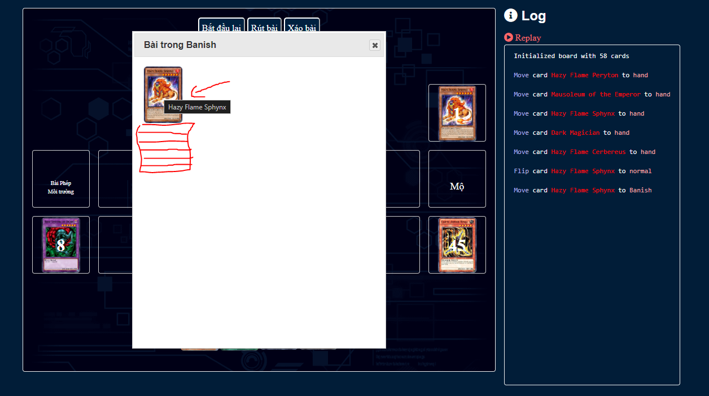
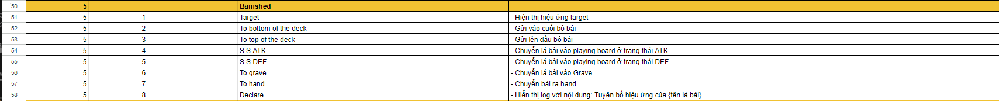
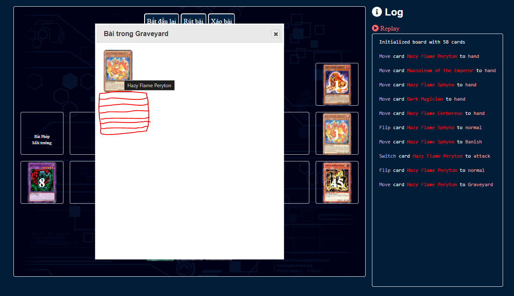
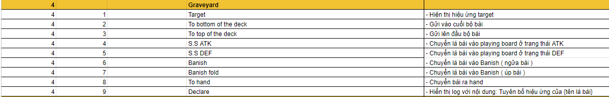
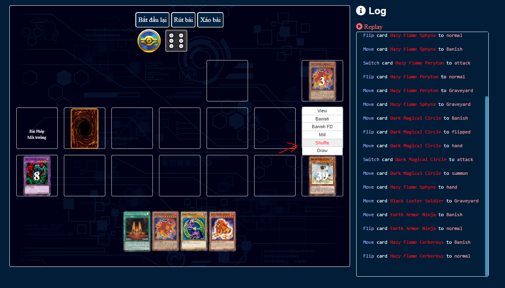
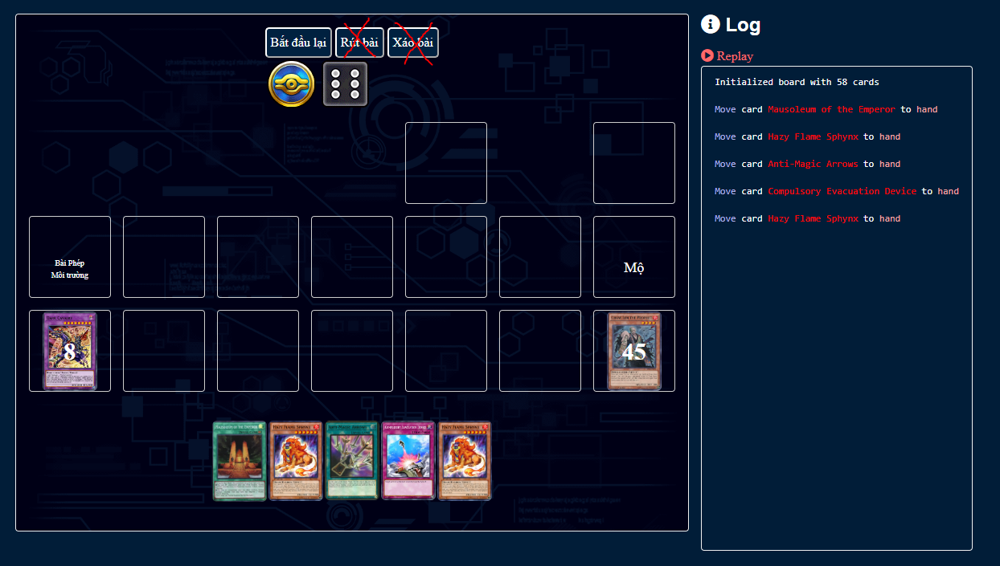
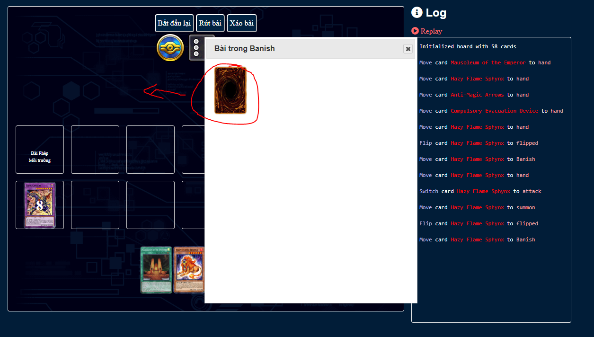
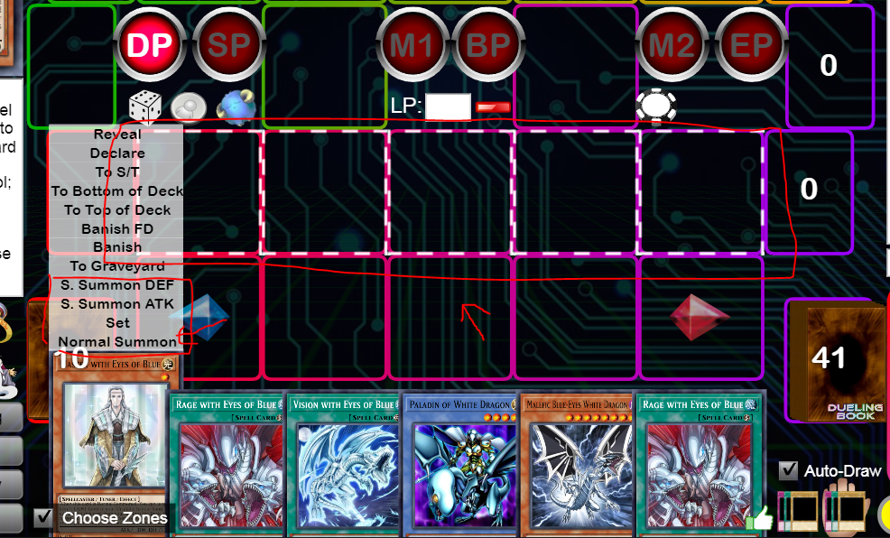
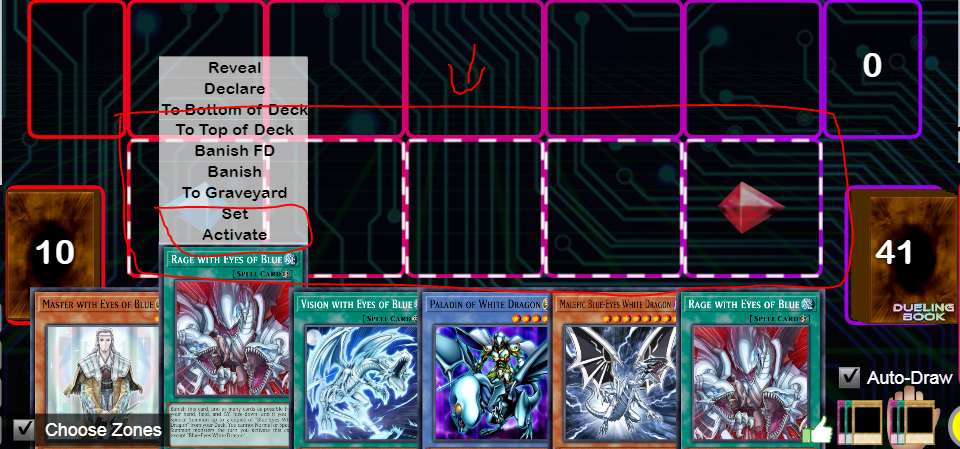

# Issues

# Table of Contents
1. [Link document](#link)
2. [Create another/missing slot](#missing)
3. [Make Banish modal contain option when hover over card like in deck](#banish)
4. [Make Graveyard modal contain option when hover over card like in deck](#graveyard)
5. [Only Shuffle card inside deck when clicking Shuffle](#shuffle)
6. [Remove "Rút bài" and "Xáo bài" button](#remove)
7. [Flip card face-up after moving out of Banish (face down)](#flip)
8. [Cannot interact with cards at bottom of Deck](#interact)
9. [Allow user to select slot when Summon/To ST](#slot)
9. [Options each section is not correct](#option)

## Link document
Link Docs: <https://docs.google.com/spreadsheets/d/1yPdlia4M1HTvMAp04LVtKeq5SNbCjfamsNX8IZ3FKBY/edit?usp=sharing>

## Create another/missing slot

Add missing red slot

## Make Banish modal contain option when hover over card like in deck

When user open cards is in Banish. User should be able to send them to different sections 

Options

## Make Graveyard modal contain option when hover over card like in deck

When user open cards is in Graveyard. User should be able to send them to different sections 

Options

## Only Shuffle card inside deck when clicking Shuffle

When user click on shuffle on Deck. Only shuffle cards that are currently inside the deck.

## Remove "Rút bài" and "Xáo bài" button

Remove the above buttons since user can do it by click on Deck.

## Flip card face-up after moving out of Banish (face down)

If card is banished face-down, when user move that card out of banish, that card will flip face up like regular card.

## Cannot interact with cards at bottom of Deck

Open deck, scroll to bottom, when user try to interact with those cards, they got automatically scrolled up.

Expected: User should be able to get any cards without interruption

## Allow user to select slot when Summon/To ST

When user click on Summon or To ST, they can select the slot that the card will be placed instead of auto-selected.

Zone's border will be hight light/animation to show where card can be placed.

Zone's border will be cancel when user click on any different area.

Image from Dueling book.

## Options each section is not correct

Options will be different when card in different section. Options is in the excel document.

