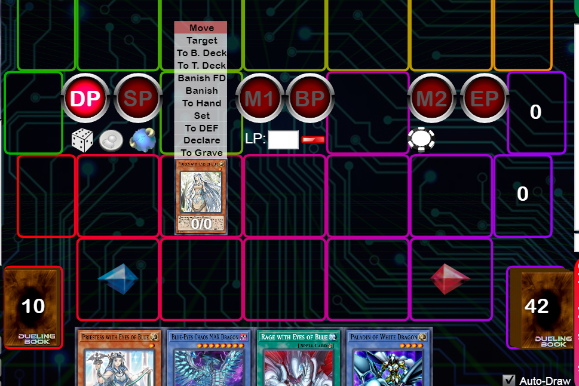
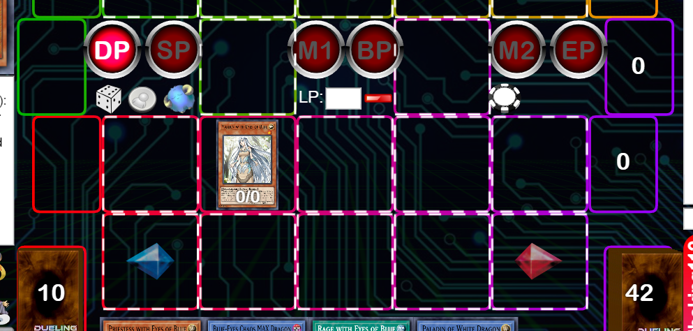
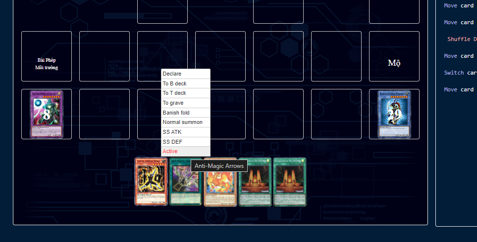
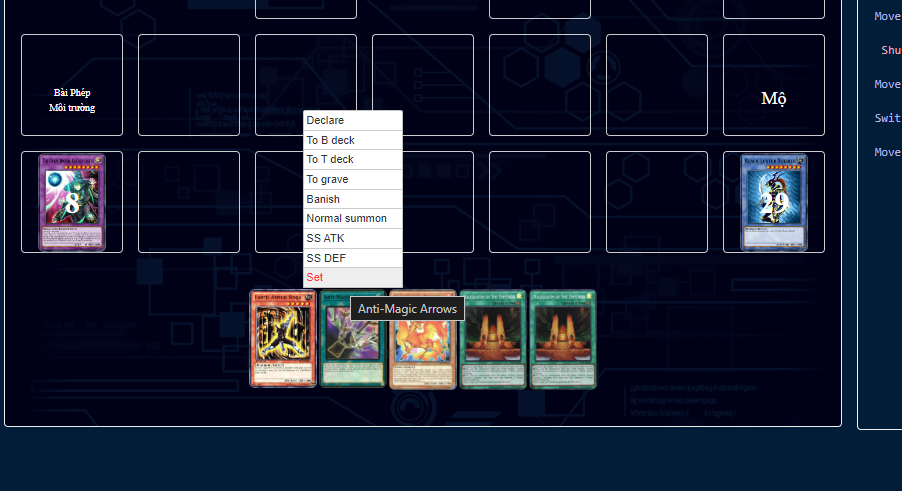
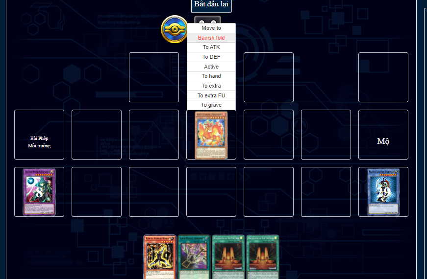
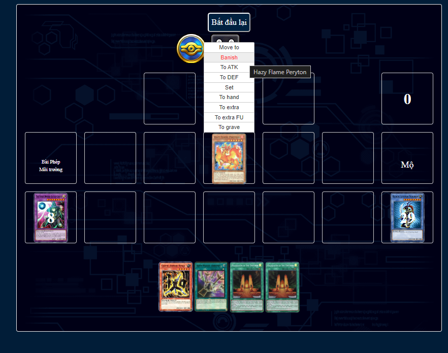

# Issues #3

### Remove add card to hand when clicking on card in any section.

-   User will need to click **To Hand** to actually moving card from that section to hand.

### Update Declare log

-   When clicking on Declare, log should be: **Declared effect of {cardname}**

### Move to not working

**Move to** doesn't move the card, when select **Move to**, user can move the card to the available zone.

### Highlight monster zone when summon

-   When clicking on Normal Summon/SS ATK/SS DEF, highlighting the border of available zone that user can select to indicate user need to select the zone to summon that card.
    

### Highlight Spell/Trap zone when Active/Set

-   When clicking on Set/Active, highlighting the border of the available zone that user can select to indicate user need to select the zone to activate/set that card.

### Highlight zones when Move To

-   When clicking on Move to, highlighting the border of the available zone that user can select to indicate user need to select the zone to move that card into.

### Active/Set Spell/Trap options not showing consistent

-   Active/Set of spell/trap card is not showing consistent. When hover over spell/trap card, it should be Set and Active option at the same time.(Active = Face up on Spell/Trap Zone, Set = Face down on Spell/Trap Zone).

### Banish/Banish FD not showing consistently
- Banish/Banish FD is not showing for monster on the zone. Monster Card should have the Banish/Banish FD button at the same time to moving that card to banish section.

### Scrolling log after run replay
- Log not always scroll to the latest log view **after run replay**. 
- User need to scroll to the bottom of log automatically when they do any action.

### Summon from extra deck to extra monster zone
- Monster in Extra Deck can be Summon to the top 2 slots/zones on the board.

### Cannot Summon/Set/SS ATK/SS DEF monster if there is monster on board
- When there is a monster on board, cannot summon a different monster.
- User can summon many monster as long as there is available zone on the board.

### Cannot Active/Set Spell/Trap card if there is an Active/Set Spell/Trap on the board
- When there is an Active/Set Spell/Trap on board, cannot Active/Set a different Spell/Trap card.
- User can Active/Set many Spell/Trap card as long as there is available zone on the board.

### Start the deck with a json file. 
- [Sample json](https://ygovietnamcdn.azureedge.net/storage/Assets/sample-simulator-deck.json)
- This json contains 2 array of card's information (mainDeck and extraDeck) 
    - mainDeck are cards in deck. 
    - extraDeck are cards in extra deck. 
    - (Should keep the original json, can add any new property to the new (created) json however you want)

### Improve Start/Stop record

- Add a Start Record and Stop Record button. 
- Only start saving steps when user click on Start Record.
- Only stop saving step when user click on Stop Record. 
- If user click on Start Record, they will lose the previous record.

