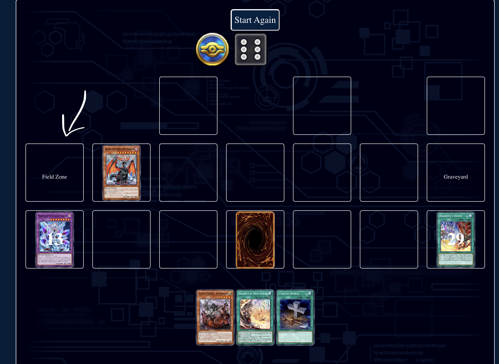

# Issue 4

## Responsive
- Make UI responsive for mobile devices. User should interact with cards on Field, Hand, Banished, Extra Deck, Deck, Graveyard normally.

- Visit https://www.duelingbook.com/ for reference.

## Add "Reveal" to hand menu option

- Add "Reveal" option for card on hand.
- When user select "Reveal" => Log a message "Reveal {card-name}"

## Fold card when user select "Set" on a monster on the field

- When user select "Set", card will be in fold - defend position.
    - Set => defend face-down.
    - To DEF => defend face-up.

## Allow user to select field zone

- Allow user to select Field zone (Field Spell) for Spell Card
- This will allow user to put Spell card in Field Zone (Field Spell)

