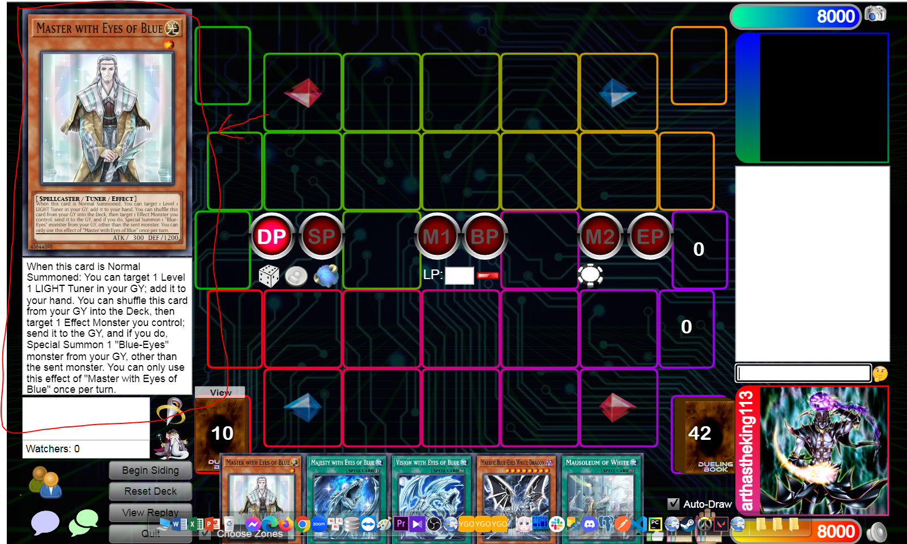

# Issue 4

## Add Card Information Details

- On Desktop:
    - Add left area to show card image and Card Description.
    - When hover mouse over the card on any area/zone , show card image/description on the left area.
    - Fixed height for Image, description can be scrollable
    - 

- On Mobile:
    - Left area to show card image/description will be hidden.
    - Add an option to card on any areas/zones called "View". This will show card image + description
    - Description can be scrollable

## Pause/Resume replay

- When playing Replay, add Pause/Resume button.
    - When Playing replay, user can click Pause to temporary stop the replay.
    - When replayed is paused, user can click Resume to continue playing the replay.